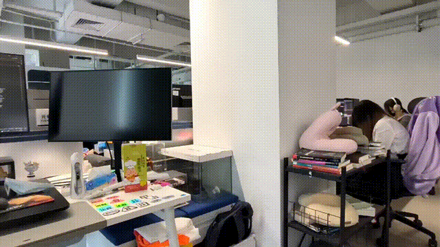
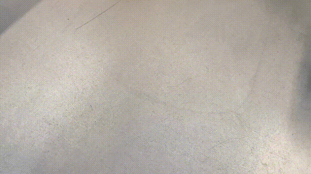
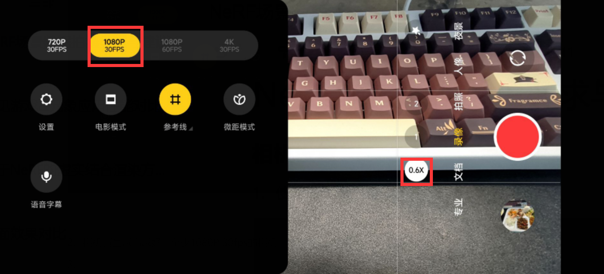
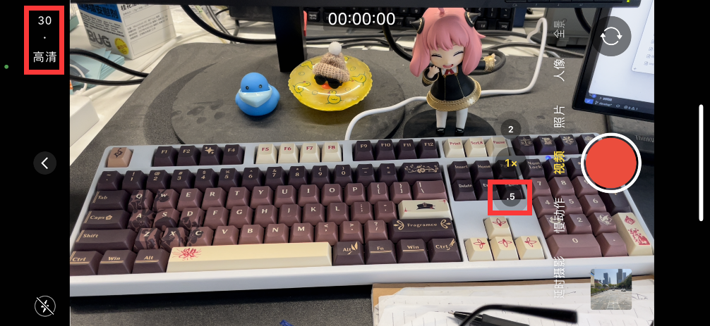
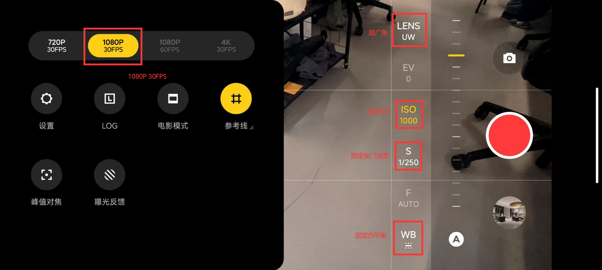
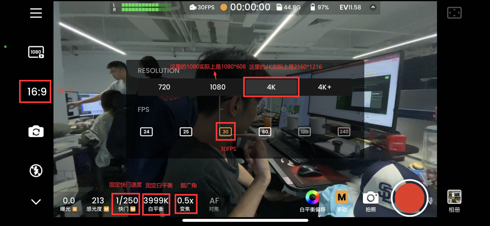
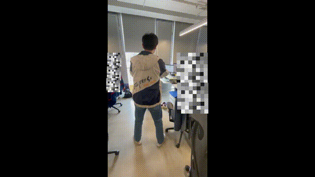
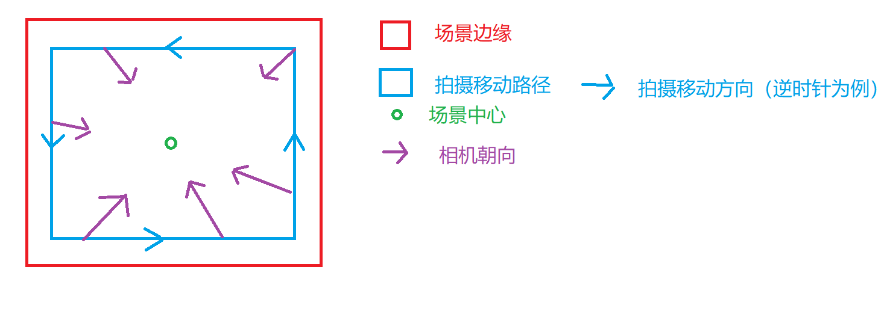
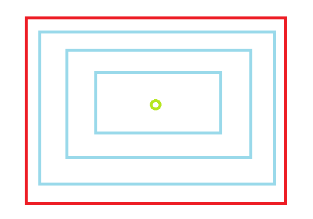

# 单个场景数据拍摄要求与建议

## 简介

TIPS：本文档可能会根据后续情况进行更新迭代，非最终版

注意事项：
- 拍出来的视频不要模糊，镜头运动要慢。
- 拍摄图像越多越好，没拍到的地方就重建不出来
- 运动物体重建不出来，透明物体重建不出来
- 可以拍摄多段视频，后期拼成一个

重点总结：
- iphone手机拍摄：横屏，广角，2k，详见1.2
- 在拍摄路径的每一个点位上，站定一个位置，手持手机从上到下拍摄（人手持手机从直立到蹲下），然后跨步到下个点位，详见1.3
- 拍摄单个物体，拍摄路径是：以被拍摄物体为中心，相机面朝被拍摄物体，近、中、远距离环绕绕圈拍三圈
- 拍摄单个房间，拍摄路径是：以自身为中心，相机面朝房间，近、中、远距离环绕绕圈拍三圈
- 复杂场景拍摄文档后续补充

## 1.1 拍摄注意事项

- 避免拍摄移动/动态的物体，例如行人，汽车，闪烁的灯光，播放视频的屏幕，尽量拍摄静止场景
- 避免拍摄时大幅度的视角移动/旋转导致的动态模糊，保证镜头的移动和旋转处在一个较慢且平滑的状态。下面是错误示例：过快的镜头晃动，导致暂停时画面都是模糊的

- 避免拍摄时出现大范围的近景遮档，保证前后帧的重合率在80%以上，尽量保证处于一个能看到多个场景部分的“上帝视角”

- 避免拍摄时出现大范围的无纹理/无特征区域，例如无任何特征的白色墙壁，如果场景本身的特征确实不明显，可以考虑手动添加特征，例如挂一幅画，放一个标志物等等

## 1.2 相机设置相关

1.使用手机自带的相机APP，广角模式拍摄视频，16:9横向拍摄，相机质量越高越好，要求至少分辨率1080P（要求拍出来的分辨率不小于1920*1080），帧率30fps的相机，eg. 最好是IPhone 12pro以上的广角模式，专业摄像机更佳

- 拍摄比例设置
  可参考：[iPhone手机怎么调整拍照的尺寸比例](https://jingyan.baidu.com/article/93f9803fedc7fba1e46f55d9.html)
- 相机分辨率&帧率设置
  可参考：[iPhone相机分辨率怎么设置](https://jingyan.baidu.com/article/b87fe19ec09b21121935687e.html#:~:text=%E8%8B%B9%E6%9E%9C%E7%9B%B8%E6%9C%BA%E5%88%86%E8%BE%A8%E7%8E%87%E8%B0%83%E8%8A%82%E6%96%B9%E6%B3%95%E5%92%8C%E6%AD%A5%E9%AA%A4%EF%BC%9A.%20%E6%83%B3%E8%A6%81%E8%B0%83%E8%8A%82%E7%9B%B8%E6%9C%BA%E5%88%86%E8%BE%A8%E7%8E%87%E6%97%B6%E6%89%93%E5%BC%80%E6%89%8B%E6%9C%BA%EF%BC%8C%E7%84%B6%E5%90%8E%E7%82%B9%E5%87%BB%E2%80%9C%E8%AE%BE%E7%BD%AE%E2%80%9D%E3%80%82.,%E6%89%93%E5%BC%80%E8%AE%BE%E7%BD%AE%E7%95%8C%E9%9D%A2%E5%90%8E%E5%90%91%E4%B8%8B%E6%BB%91%E5%8A%A8%EF%BC%8C%E7%84%B6%E5%90%8E%E7%82%B9%E5%87%BB%E2%80%9C%E7%9B%B8%E6%9C%BA%E2%80%9D%E8%AE%BE%E7%BD%AE%E9%A1%B9%E3%80%82.%20%E6%89%93%E5%BC%80%E7%9B%B8%E6%9C%BA%E8%AE%BE%E7%BD%AE%E7%95%8C%E9%9D%A2%E7%82%B9%E5%87%BB%E2%80%9C%E5%BD%95%E5%88%B6%E8%A7%86%E9%A2%91%E2%80%9D%E3%80%82.%20%E6%89%93%E5%BC%80%E5%BD%95%E5%88%B6%E8%A7%86%E9%A2%91%E8%AE%BE%E7%BD%AE%E7%95%8C%E9%9D%A2%EF%BC%8C%E7%84%B6%E5%90%8E%E6%A0%B9%E6%8D%AE%E9%9C%80%E8%A6%81%E7%82%B9%E9%80%89%E5%88%86%E8%BE%A8%E7%8E%87%E5%8D%B3%E5%8F%AF%E3%80%82.)
- 示例：

安卓手机相机拍摄设置参考

苹果手机相机拍摄设置参考

2.（推荐）使用专业模式进行拍摄，手动设置并固定拍摄时地参数，推荐设置顺序如下
  a.首先设置拍摄分辨率和超广角，保证分辨率大于1920*1080，30fps

  b.设置快门速度（推荐1/200 - 1/250，可以避免动态模糊），这时场景可能会偏暗

  c.调整ISO让场景看起来亮度比较正常，如果觉得偏暗就调大ISO，偏亮就调小ISO，如果ISO不得不调的很大，可能会有比较严重的噪声，这时候可以考虑把快门速度降低

  d.调整白平衡，让场景颜色看起来比较正常

 
 安卓手机相机专业拍摄设置参考 
 

 
 苹果手机相机专业拍摄设置参考（需要下载Relens，专业相机模式） 
 

## 1.3 单个点位拍摄示范

参考下面视频中的拍摄者，在拍摄路径的每一个点位上，先站定一个位置，手持手机从上到下拍摄（人手持手机从直立到蹲下），然后跨步到下个点位，直到走完整条拍摄路径

## 1.4 拍摄单个物体路径规划

  1.平举相机面向场景中心，以环绕场景中心的方式开始拍摄，拍摄手法参考1.3
  
  2.开始拍摄后的第一圈环绕，镜头指向场景中心，尽量让场景中心处于镜头中心，如果是为了避开拍摄注意事项中提到的点，可以对镜头进行适当的调整（左右移动旋转，或是抬高降低），或是对移动路径进行微调
    a.TIP：避开注意事项中提及到的点重要程度大于保持拍摄移动路径，例如如果是为了避开行人，或者是避开大面积的近景墙面，可以适当地改变移动路径（拉远镜头）

  

  3.按2中的要求远中近拍摄三圈

  

## 1.5 拍摄房间物体路径规划
和1.4一致，只是相机朝向从超内改成朝外

 

## Contributors

