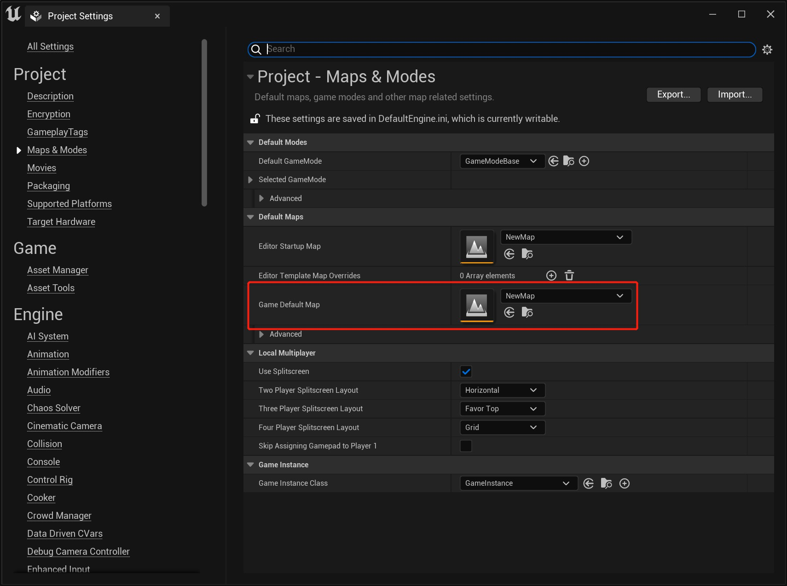
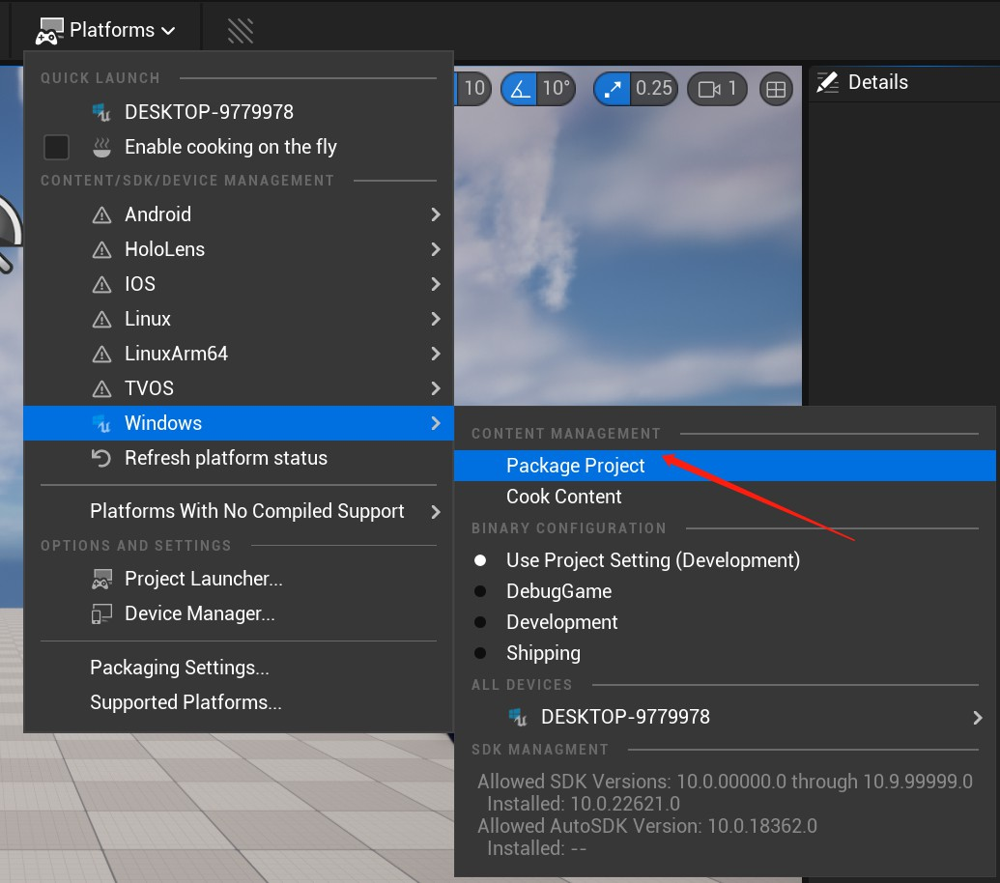
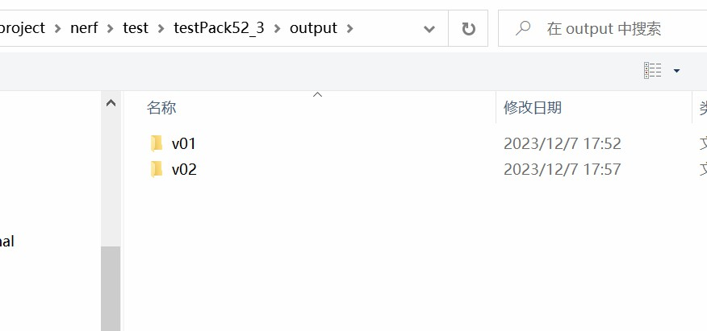
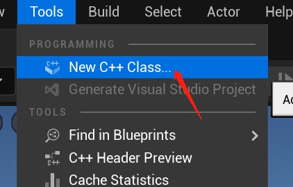
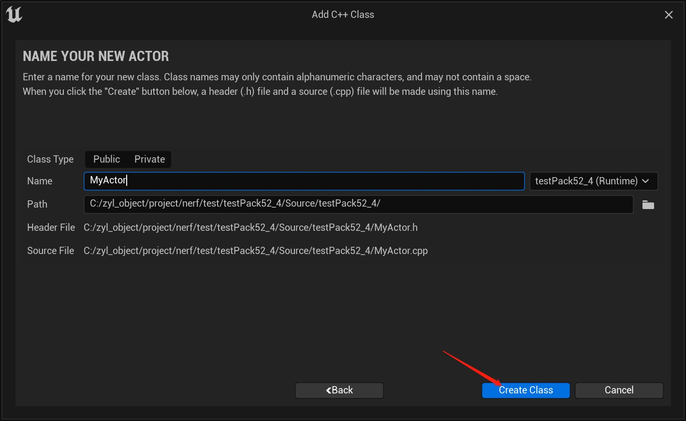
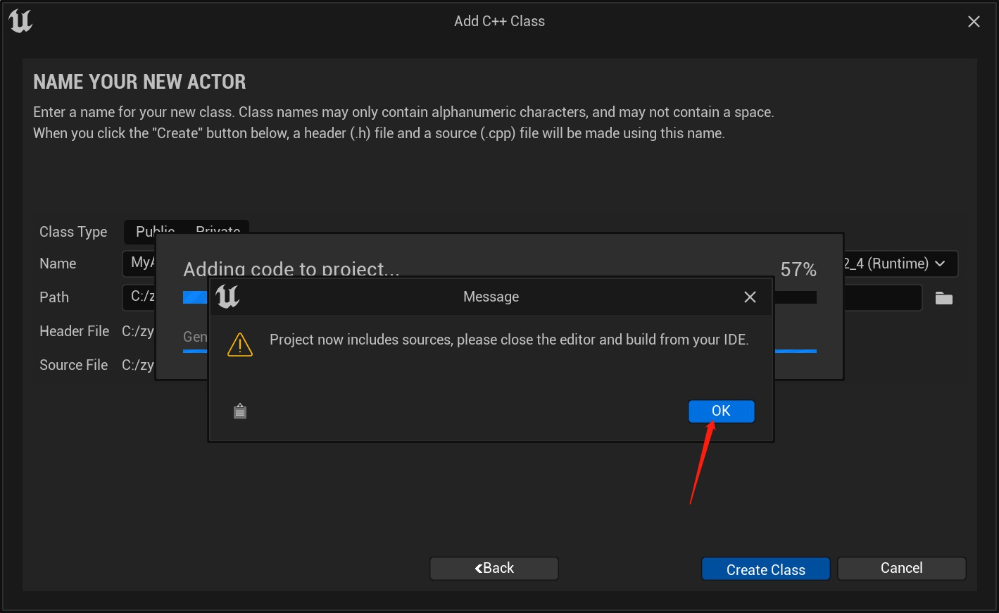
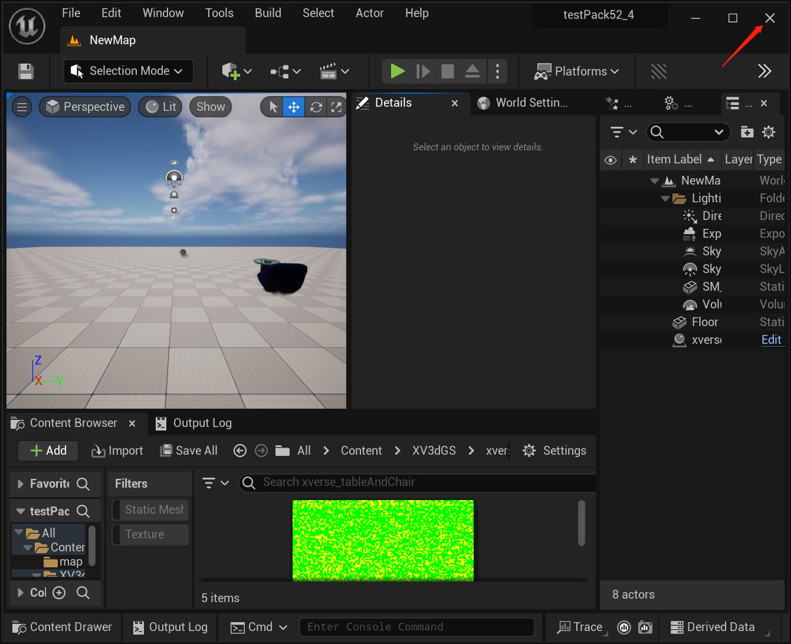
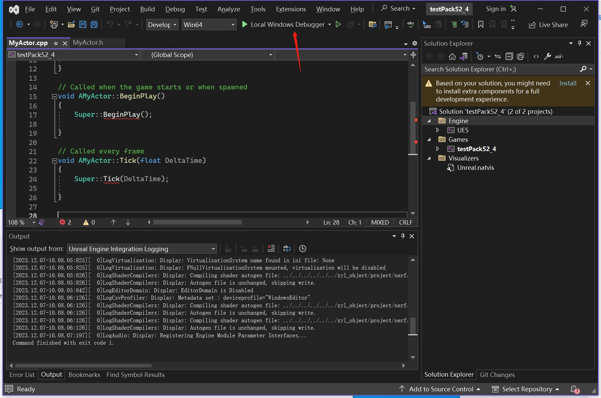
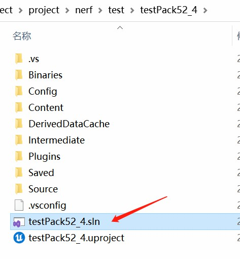

# Packaging for Windows With Our Plugins
English | [中文](./Pack_CN.md)
## Introduction

Currently only c++ projects are supported for packaging, see 1.1

If it is a blueprint project, it needs to be converted to c++ project first, see 1.2

In the future, direct blueprint project packaging will be supported

## 1.1 Packing c++ UE projcet
### a. Set the game default map

### b. pack

 

## 1.2 Converted BP project to c++ project

### a. add c++ class 

### b. close UE, open with visual studio

 **_NOTE:_**  Visual Studio will start automatically when adding a C++ class. If not, please start it manually in the project directory.

## Contributors

