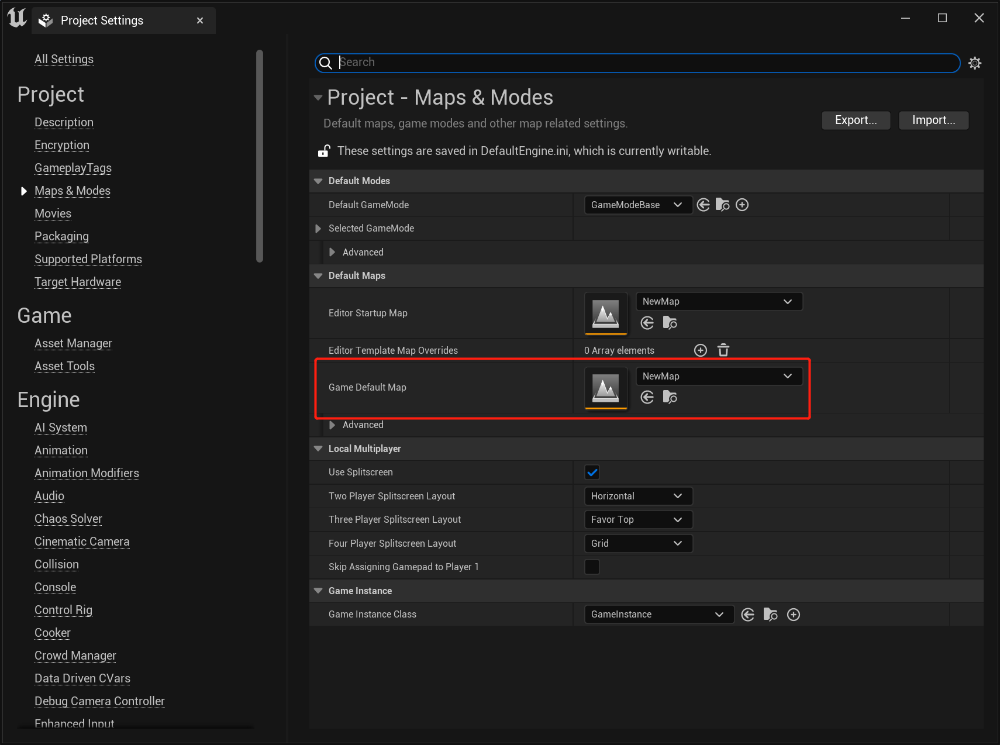
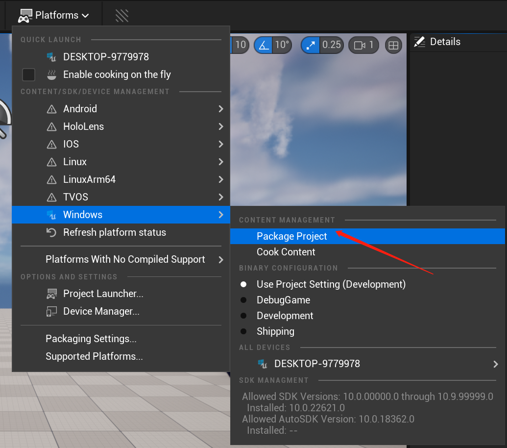
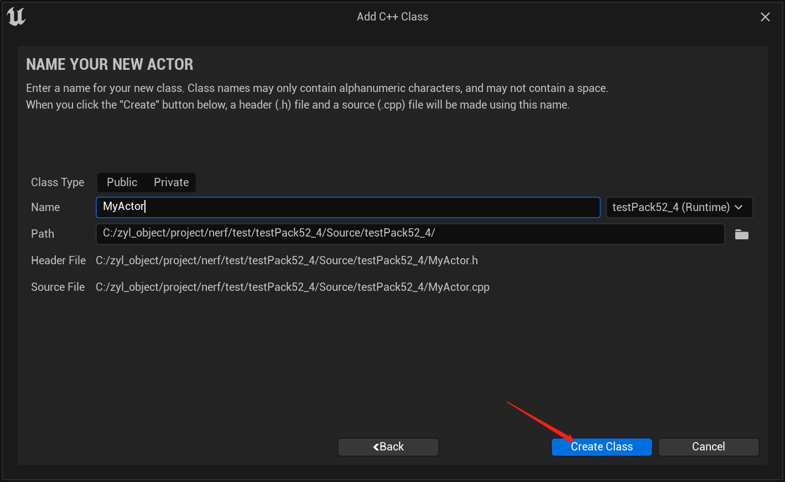
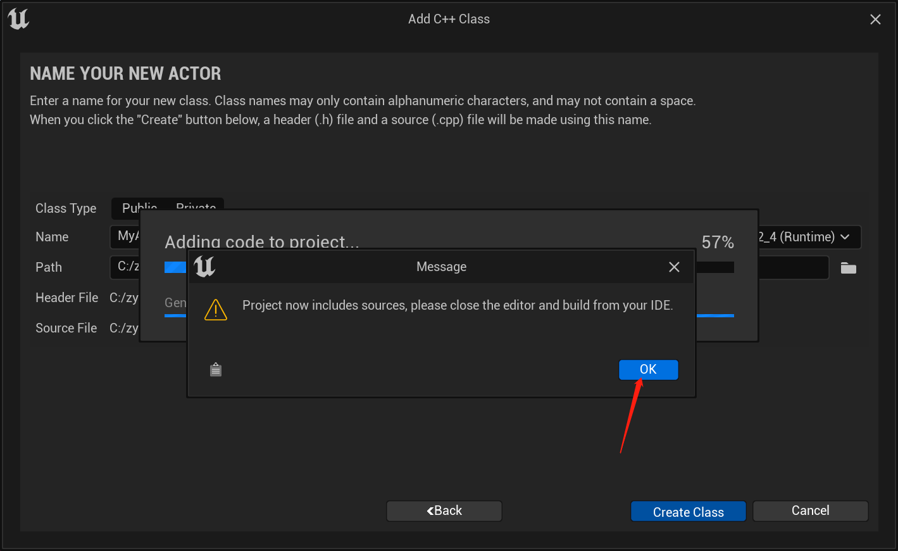
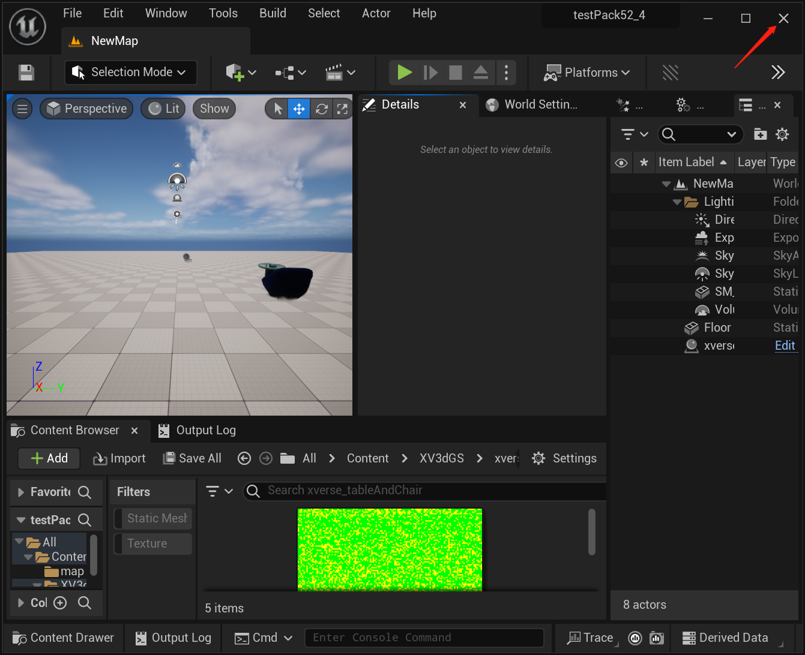
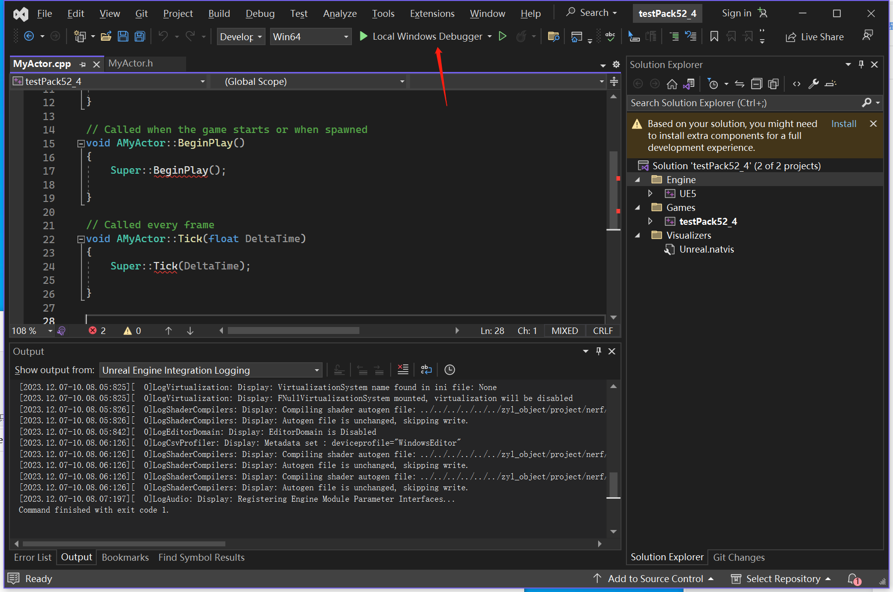
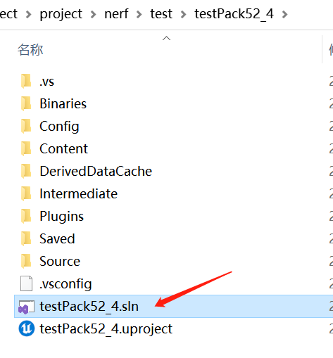

# 如何使用我们的插件打包WINDOWS程序

## 简介

目前只支持c++工程进行打包，见1.1
如果是蓝图工程，需要先转换成c++工程，见 1.2
后续会支持直接蓝图使用工程打包

[English](./Pack.md)|  中文
## 1.1 c++工程打包
### a. 设置默认地图关卡

### b. 打包

 

## 1.2 蓝图工程转换成c++工程

### a. 添加c++ class 

### b. 关闭UE窗口，用visual studio打开

注意:通常情况下，Visual Studio会在添加c++类时自动启动。如果没有，请在项目目录中手动启动。

## Contributors

