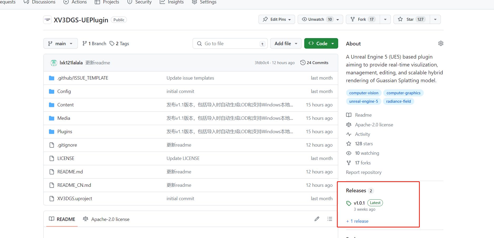
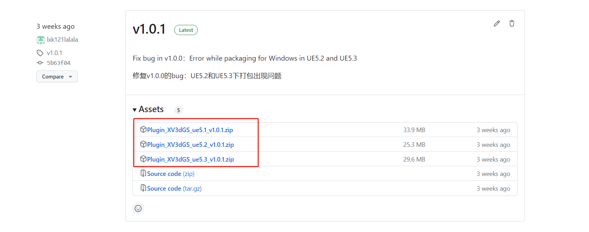
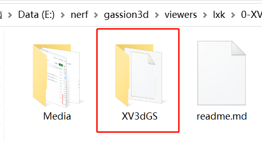

使用说明：
1. 打开github网址Release页面 [github地址](https://github.com/xverse-engine/XV3DGS-UEPlugin) 

2. 下载和你使用的ue版本对应的插件压缩包

3. 解压到当前目录

Instructions

1. Open github Release page [github地址](https://github.com/xverse-engine/XV3DGS-UEPlugin) 

2. Download the zip corresponding to the UE version you are using

3. Unzip to this directory

