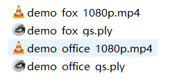
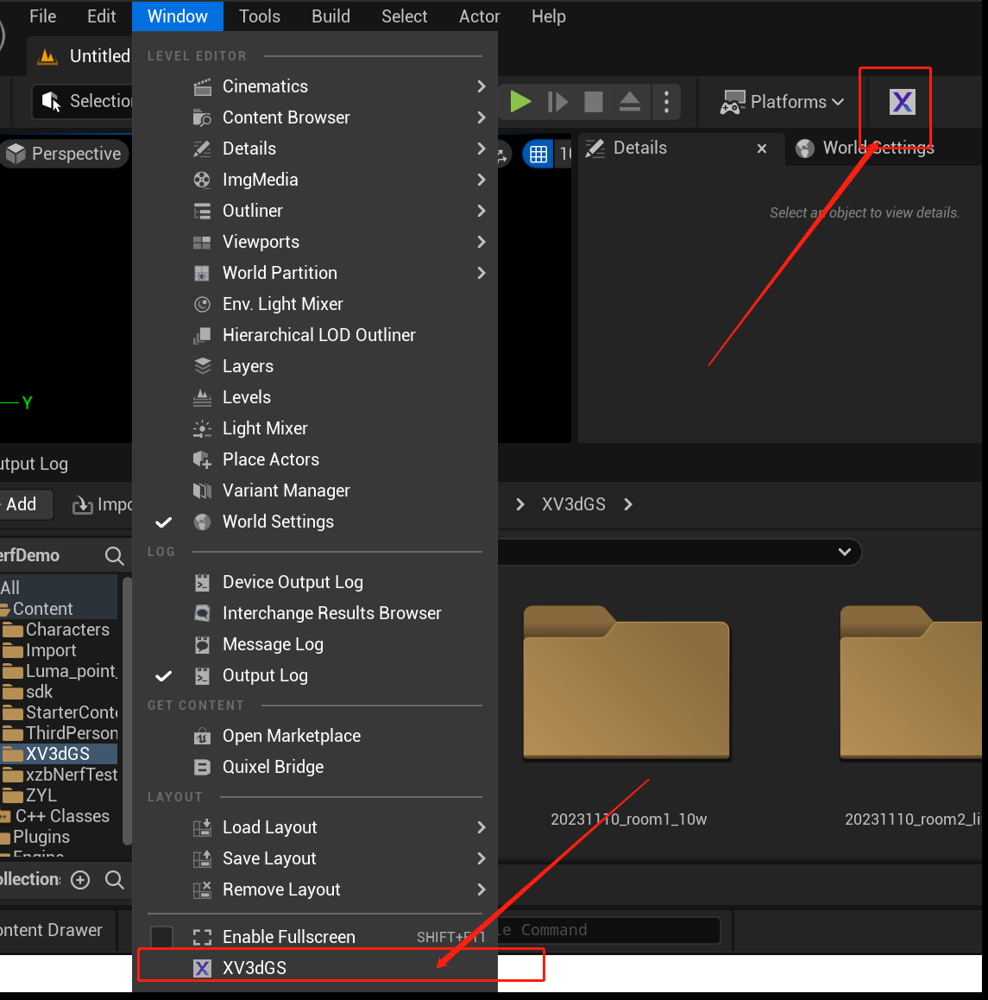
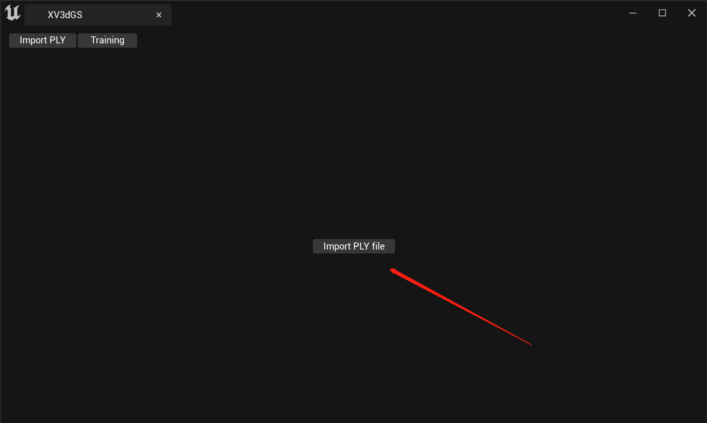
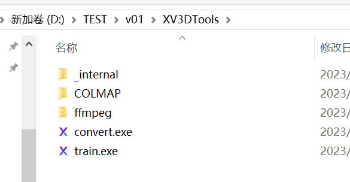
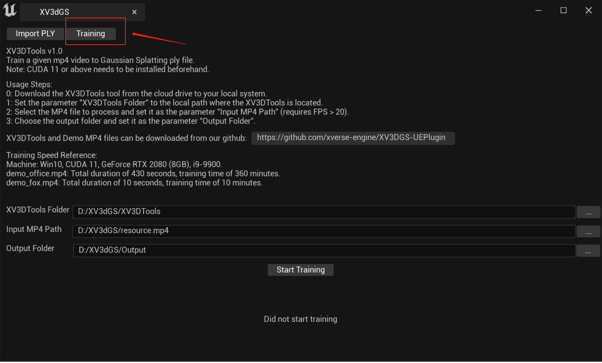
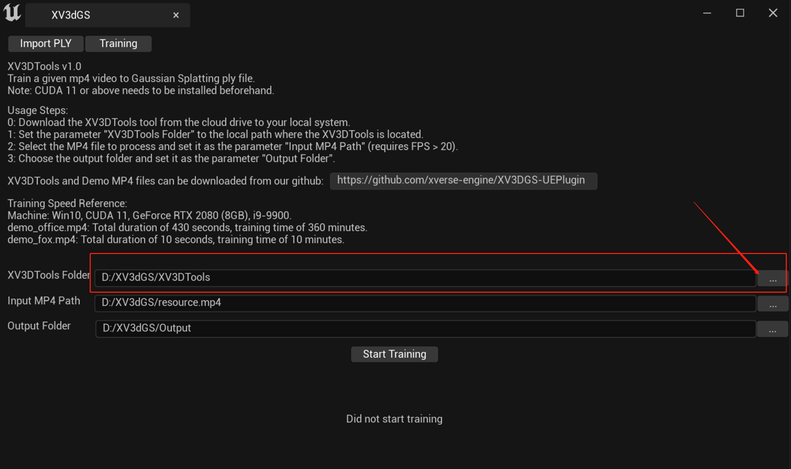
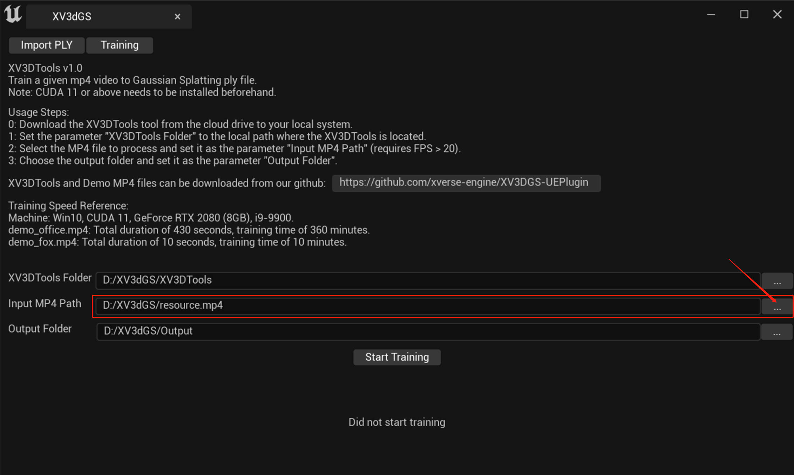
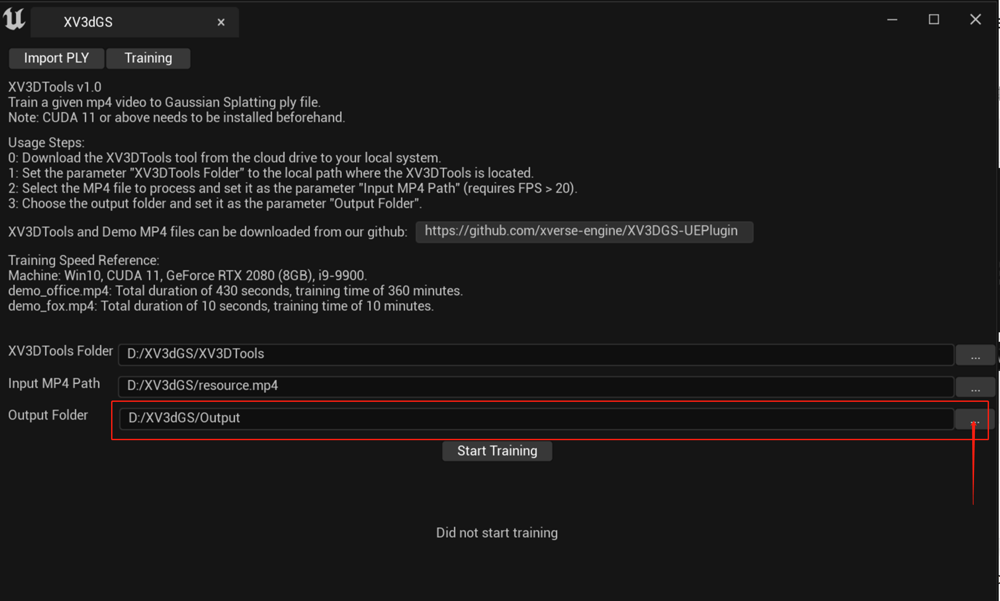
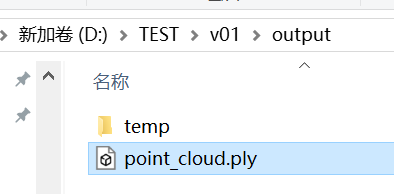

# XVERSE 3D-GS UE Plugin

<a href="./LICENSE">
        </a>

English | [中文](./README_CN.md)

[
  
](http://xverse.cn/)


# Introduction

XVERSE 3D Gaussian Splatting UE plugin（XVERSE 3D-GS UE Plugin）is an Unreal Engine 5 (UE5) based plugin developed by XVERSE Technology Inc. (Zhenshen, China), aiming to provide real-time visualization, management, editing, and scalable hybrid rendering of Gaussian Splatting model, which is a recently arised technique for reconstructing 3D scenes from multiple photos, more details can refer to [here](https://repo-sam.inria.fr/fungraph/3d-gaussian-splatting/).

Currently, our plugin is implemented based on UE5 Niagara, fully exploiting the advantage of the features provided by UE5 to realize efficient rendering and managing for Guassian Splatting models.

Since we are at early access, current accessible features are summarized below:
- Niagara-Based High-quality real-time visualizing and rendering for 3D Gaussian Splatting
- Easily importing and converting from the original Gaussian Splatting scene (.ply file) to ours
- Hybrid rendering with other UE assets 
- RTS and Geometry Editing 
- Support dynamic illumination of Gaussian Splatting scene
- Automatic lod generation, supporting over 200,000 point clouds in niagara
- **_Training tools in Windows system (XV3DTools v1.0)_**： train a given mp4 video to GaussianSplatting ply file

We will actively release new features in this repo, please stay tuned. Some future updates will contain:
- [ ] VFX system
- [ ] Dynamic Lod Rendering
- [ ] Automatic collision generation
- [ ] Support preview window
- [ ] Edit 3D-GS assets
- [ ] 3D-GS assets compression

# Getting Started

## System Requirements

- Windows 10 or 11
- Unreal Engine 5.1.x / 5.2.x / 5.3.x
- cuda11 or higher (if using the XV3DTools)


## Plugin download
You can get the latest plugin by using `git clone`, by default we put a plugin of UE5.1 under [Plugins](./Plugins/)


```
git clone https://github.com/xverse-engine/XV3DGS-UEPlugin.git
```

Plugins for different UE5 versions can be found under [demo](./demo/), extract and install the corresponding version if you are not using UE5.1.

Or you can download the desired version of the plugin in [release](https://github.com/xverse-engine/XV3DGS-UEPlugin/releases)
 
  

 ## Demo Data Download Links:

We have provided two sets of test data available for download at:
- [Baidu Pan Download Link](https://pan.baidu.com/s/1-cwEXounPJBNtkJe5PJuSw?pwd=XV3D)
- [Google Drive Download Link](https://drive.google.com/drive/folders/1EgVZyYgFbYJqshA6xUheEG7JrEIgsmzR?usp=sharing)

Included in these downloads are `demo_fox_1080p.mp4` and `demo_office_1080p.mp4`, serving as two sample MP4 files for testing XV3DTools' local training capabilities.

`demo_fox_gs.ply` and `demo_office_gs.ply` are 3DGS models trained by XV3DTools, which can be imported into Unreal Engine (UE) using this plugin for real-time rendering.


## Open demo project
This repo contains a demo project with an example scene and level 
1. Open `XV3DGS.uproject` to start UE
2. Open `demo` level


## Import your guassian splatting model
Click on the 'Load Assets' button on the navigation bar or navigate to Window/XV3dgs.


This action will bring up an integrated tool page by default set to load the PLY page. Click on the 'Load PLY' button.



This will trigger a resource selection window to appear.


Choose your Gaussian model file (in .ply format), then it will automaticly generate LOD and loaded into your Content Browser as a blueprint.


Drag the blueprint into Level Viewport and you can see your Gaussian scene.


## Local Training on Windows Platform

We develop the XV3DTools v1.0 to train MP4 videos into Gaussian Splatting ply.

**_Please Note:_** Installation of CUDA 11 or higher is required. [CUDA Download Link](https://developer.nvidia.com/cuda-downloads)

### XV3DTools Usage Steps:

0. Download XV3DTools (v1.0) tool from the cloud drive to your local machine: [Baidu Pan Download Link](https://pan.baidu.com/s/162C9Xw_t403h4C8wnD3azQ?pwd=XV3D) [Google Drive Download Link](https://drive.google.com/drive/folders/1btXlKO2OHknklRgwMfLEykSChZuPCO4-?usp=sharing)


  
  
1. Click on the icon to open the interface and switch to the 'training' page.



2. Click the button to set the parameter "XV3DTools Folder" to the local path where XV3DTools tool is located.



3. Click the button to select the MP4 file for processing and set it as the parameter "Input MP4 Path" (requires video frame rate > 20).



4. Click the button to choose the output folder and set it as the parameter "Output Folder".



5. Training takes time. Once completed, locate the trained ply file in the output folder.




### Training Speed Reference:
- Test Machine Configuration: Windows 10, CUDA 11.8, GeForce RTX 2080 (8GB VRAM), i9-9900 processor.
- demo_fox.mp4: Video duration of 10 seconds, training time of 10 minutes.
- demo_office.mp4: Video duration of 430 seconds, training time of 360 minutes.


## Packaged demo project
We provide a packaged Windows executable demo, you can download `pack_win_exe.zip` from [release](https://github.com/xverse-engine/XV3DGS-UEPlugin/releases), simply double-click the exe file to start it.

## Packaging for Windows With Our Plugins
[packing document](Media/Pack.md)

# Feature introduction

### RTS (Rotation, Translation, Scaling) Transform
Select the 3D-GS asset and drag it into the scene. then you can Transform it.


You can also select a 3D-GS actor in the level viewport and transform it using GIZMO.


### Model Clipping by Gaussian model

1. Add a LocationVolume to Level Viewport.


2. choose your Gaussian model bp, and Add dependency to the LocationVolume.


3. You can interactively transform this volume to a clip Gaussian splatting model.


The default state is not clipping, you can choose to kill particles inside or outside the LocationVolume.


### Dynamic illumination 
Dynamic lighting is not default opened.

you can enable it by turning on the withRelighting button.


Supports all the UE light types


The light source can be moved at will


### Change color 

Modify the AlbedoTint parameter to change the overall color.


### Dynamic Lod (coming soon)
For imported point clouds, we calculate the LOD automatically. It will switch LODs automatically based on the view distance.
Use the parameter 'VisWhichLOD' for control.


The default value for 'VisWhichLOD' is -1, indicating the use of our automatic switching algorithm. 
Other values force the use of a specific LOD level. For example, 0 represents LOD0, where the nearest one million points will be shown.

Demonstrations are showing the results of different LODs at the same position.

Each level of LOD points number is one-tenth of the previous level.

LOD0


LOD1
 


LOD2
 


## Release Note
  [v1.1.0](https://github.com/xverse-engine/XV3DGS-UEPlugin/tree/v1.1.0)
- Training tools in Windows system (XV3DTools v1.0) to train a given mp4 video to GaussianSplatting ply file
- Automatic lod generation, supporting over 200,000 point clouds in niagara
- fix bug in transform

[v1.0.1](https://github.com/xverse-engine/XV3DGS-UEPlugin/tree/v1.0.0)
- Fix bug in v1.0.0：Error while packaging for Windows in UE5.2 and UE5.3
  
[v1.0.0](https://github.com/xverse-engine/XV3DGS-UEPlugin/tree/v1.0.0)
- Niagara-Based High-quality real-time visualizing and rendering for 3D Gaussian Splatting
- Easily importing and converting from the original Gaussian Splatting scene (.ply file) to ours
- Hybrid rendering with other UE assets 
- RTS and Geometry Editing
- Apply VFX effect to Gaussian Splatting scene
- Support dynamic illumination of Gaussian Splatting scene
- Automatic enhancement of Gaussian Splatting scene 

## Contributors

<a href="https://github.com/xverse-engine/XV3DGS-UEPlugin/graphs/contributors">
  
</a>