# XVERSE 3D-GS UE Plugin

<a href="./LICENSE">
        </a>

English | [中文](./README_CN.md)

[
  
](http://xverse.cn/)


## Introduction

XVERSE 3D Gaussian Splatting UE plugin（XVERSE 3D-GS UE Plugin）is an Unreal Engine 5 (UE5) based plugin developed by XVERSE Technology Inc. (Zhenshen, China), aiming to provide real-time visualization, management, editing, and scalable hybrid rendering of Gaussian Splatting model, which is a recently arised technique for reconstructing 3D scenes from multiple photos, more details can refer to [here](https://repo-sam.inria.fr/fungraph/3d-gaussian-splatting/).

Currently, our plugin is implemented based on UE5 Niagara, fully exploiting the advantage of the features provided by UE5 to realize efficient rendering and managing for Guassian Splatting models.

Since we are at early access, current accessible features are summarized below:
- Niagara-Based High-quality real-time visualizing and rendering for 3D Gaussian Splatting
- Easily importing and converting from the original Gaussian Splatting scene (.ply file) to ours
- Hybrid rendering with other UE assets 
- RTS and Geometry Editing
- Apply VFX effect to Gaussian Splatting scene
- Support dynamic illumination of Gaussian Splatting scene
- Automatic enhancement of Gaussian Splatting scene 

We will actively release new features in this repo, please stay tuned. Some future updates will contain:
- [ ] Automatic Lod Generation at import and Dynamic Lod Rendering
- [ ] Automatic collision generation
- [ ] Support preview window
- [ ] Edit 3D-GS assets
- [ ] 3D-GS assets compression
- [ ] 3D-GS assets production

## Getting Started

### System Requirements

- Windows 10 or 11
- Unreal Engine 5.1.x / 5.2.x / 5.3.x

### Packaged demo project
We provide a packaged Windows executable demo, you can download `pack_win_exe.zip` from [release](https://github.com/xverse-engine/XV3DGS-UEPlugin/releases), simply double-click the exe file to start it.

### Plugin download
You can get the latest plugin by using `git clone`, by default we put a plugin of UE5.1 under [Plugins](./Plugins/)


```
git clone https://github.com/xverse-engine/XV3DGS-UEPlugin.git
```

Plugins for different UE5 versions can be found under [demo](./demo/), extract and install the corresponding version if you are not using UE5.1.

Or you can download the desired version of the plugin in [release](https://github.com/xverse-engine/XV3DGS-UEPlugin/releases)
 
### Open demo project
This repo contains a demo project with an example scene and level 
1. Open `XV3DGS.uproject` to start UE
2. Open `demo` level

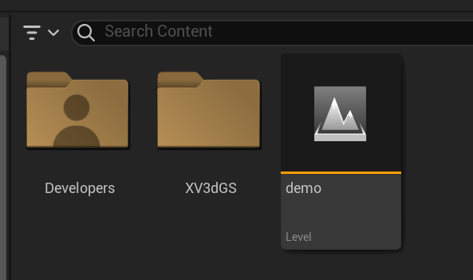

### Import your guassian splatting model
Click this load asset button in the Navigation Bar.

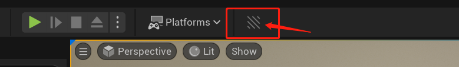

There will be a new loading dialog like this.

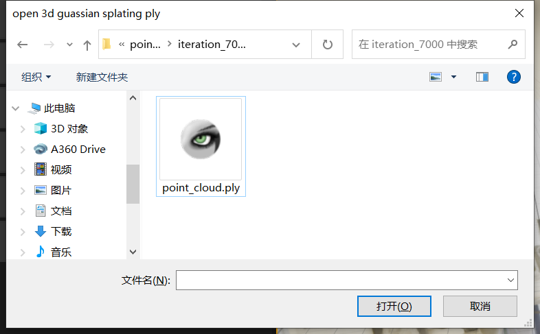

Choose your Gaussian model file (in .ply format), then it will then be converted and loaded into your Content Browser as a blueprint.

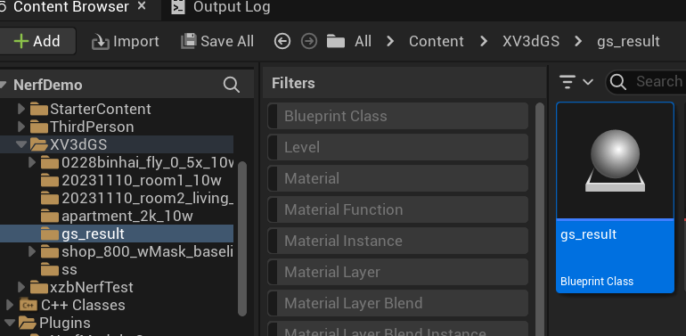

Drag the blueprint into Level Viewport and you can see your Gaussian scene.

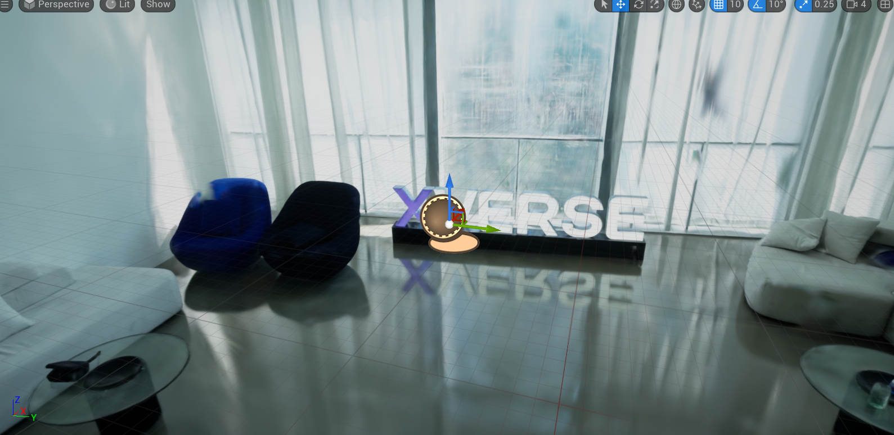

## Feature introduction

### RTS (Rotation, Translation, Scaling) Transform
Select the 3D-GS asset and drag it into the scene. then you can the Transform.

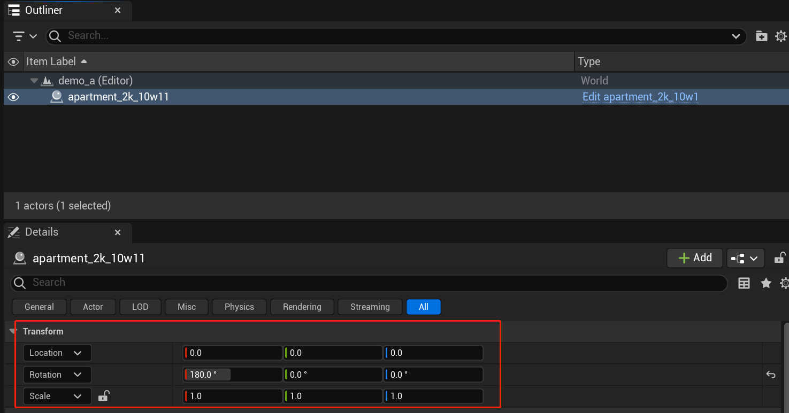

You can also select a 3D-GS actor in the level viewport and transform it using GIZMO.


### Model Clipping by Gaussian model

1. Add a LocationVolume to Level Viewport.

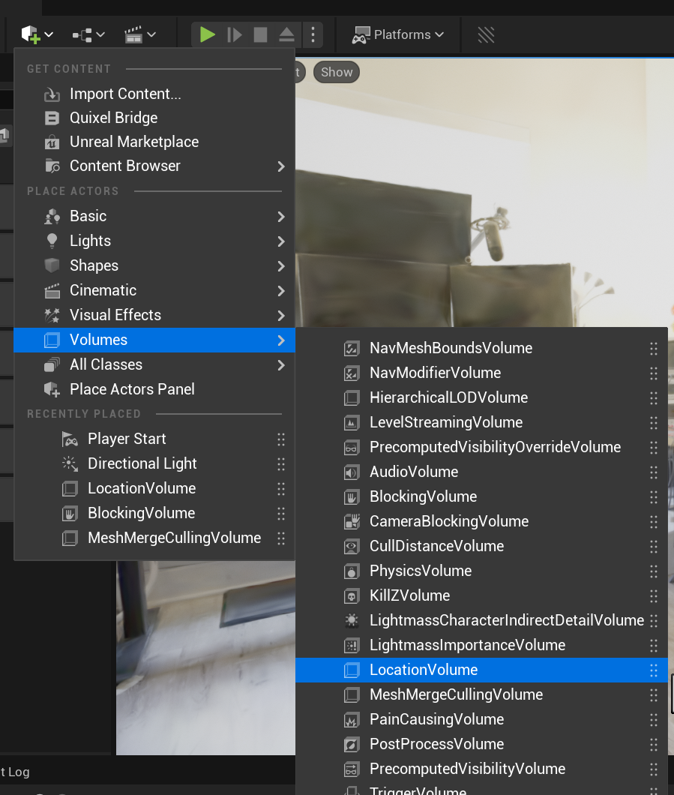

2. choose your Gaussian model bp, and Add dependency to the LocationVolume.

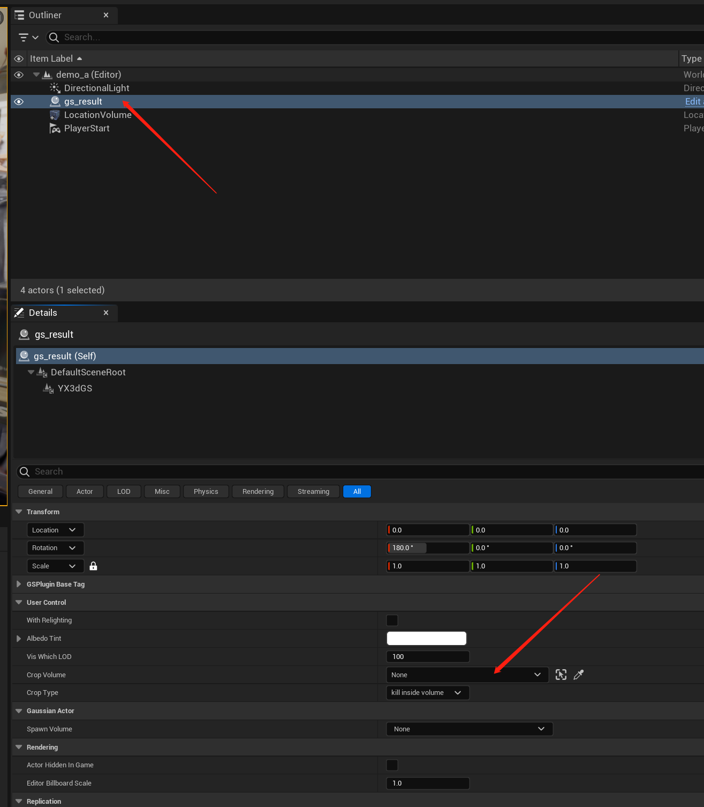

3. You can interactively transform this volume to a clip Gaussian splatting model.

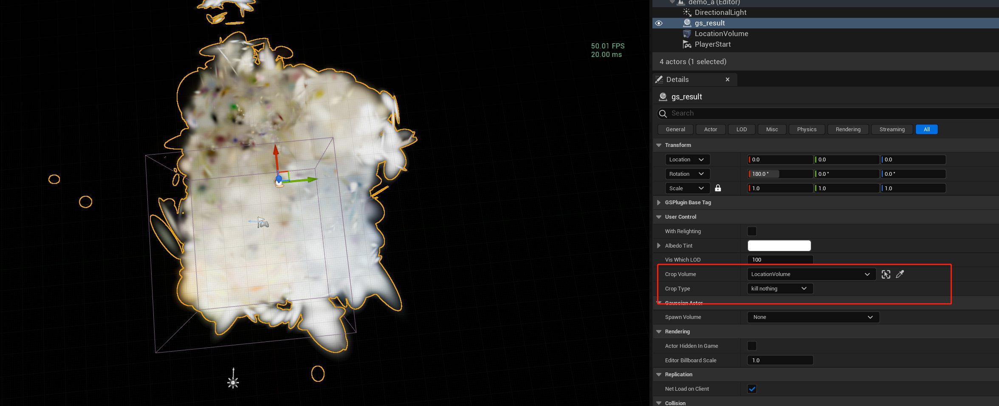

The default state is not clipping, you can choose to kill particles inside or outside the LocationVolume.

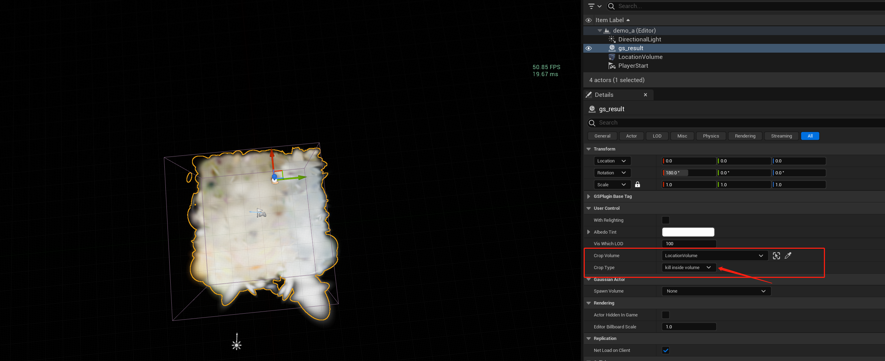

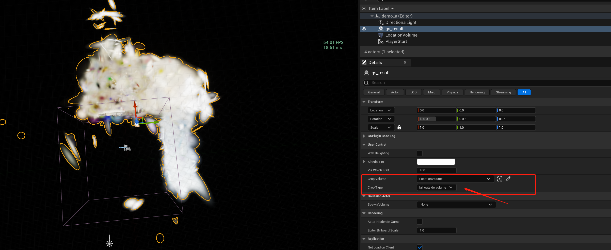

### Dynamic illumination 
Dynamic lighting is not default opened.

you can enable it by turning on the withRelighting button.


Supports all the UE light types

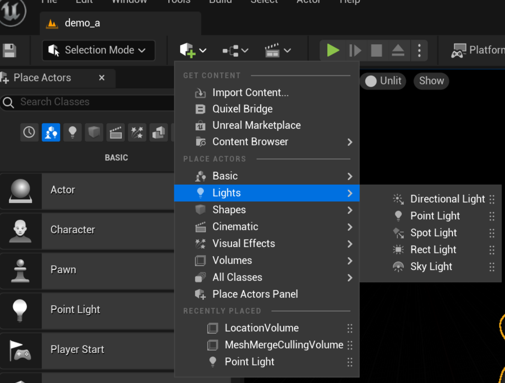

The light source can be moved at will


### Change color 

Modify the AlbedoTint parameter to change the overall color.

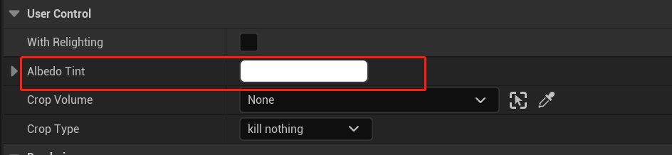


### Dynamic Lod (coming soon)
For imported point clouds, we calculate the LOD automatically. It will switch LODs automatically based on the view distance.
Use the parameter 'VisWhichLOD' for control.

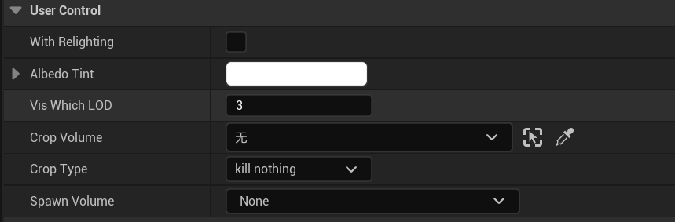

The default value for 'VisWhichLOD' is -1, indicating the use of our automatic switching algorithm. 
Other values force the use of a specific LOD level. For example, 0 represents LOD0, where the nearest one million points will be shown.

Demonstrations are showing the results of different LODs at the same position.

Each level of LOD points number is one-tenth of the previous level.

LOD0

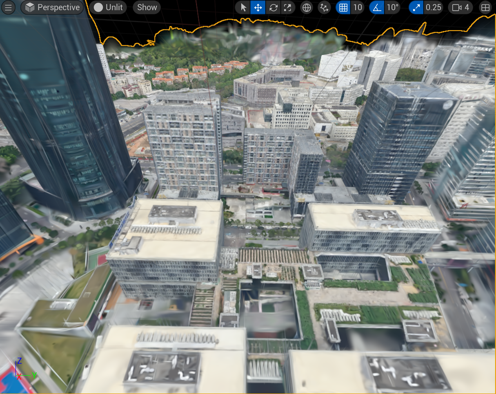

LOD1
 
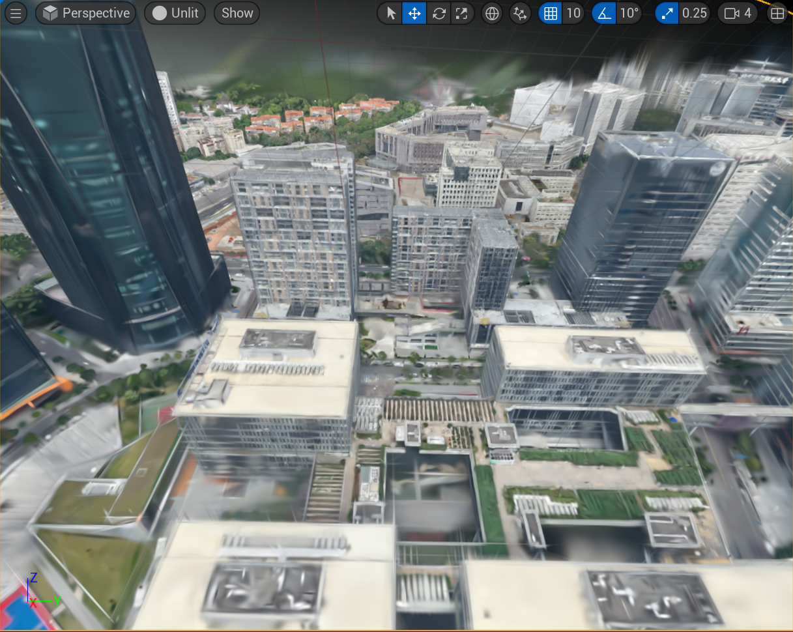

LOD2
 
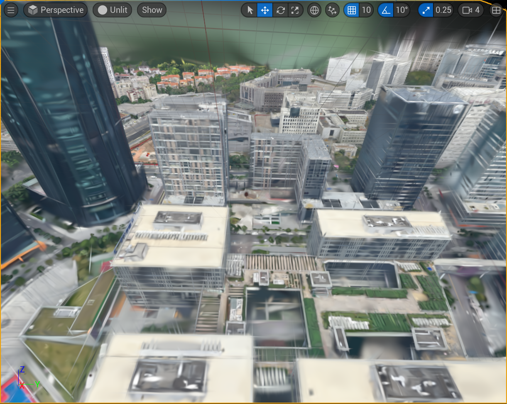


## Release Note
  
[v1.0.0](https://github.com/xverse-engine/XV3DGS-UEPlugin/tree/v1.0.0)
- Niagara-Based High-quality real-time visualizing and rendering for 3D Gaussian Splatting
- Easily importing and converting from the original Gaussian Splatting scene (.ply file) to ours
- Hybrid rendering with other UE assets 
- RTS and Geometry Editing
- Apply VFX effect to Gaussian Splatting scene
- Support dynamic illumination of Gaussian Splatting scene
- Automatic enhancement of Gaussian Splatting scene 

## Contributors

<a href="https://github.com/xverse-engine/XV3DGS-UEPlugin/graphs/contributors">
  
</a>