# XVERSE 3D-GS UE Plugin

<a href="./LICENSE">
        </a>


[English](./README.md) | 中文

[
  
](http://xverse.cn/)
 
# 介绍

XVERSE 3D Gaussian Splatting （3D-GS）UE Plugin 是基于 Unreal Engine 5 (UE5) 的混合编辑插件，由 XVERSE Technology Inc. (Zhenshen, China) 开发，旨在UE中提供 Guassian Splatting 模型的生成、呈现、混合编辑能力。Guassian Splatting 是一项最近兴起的 3D 重建技术，用于从多张照片重建 3D 场景, 更多原理可以参考[这里](https://repo-sam.inria.fr/fungraph/3d-gaussian-splatting/).

目前的插件是基于 UE5 Niagara 实现的，我们充分利用了 UE5 Niagara 提供的优势，实现了 Guassian Splatting 模型的高效渲染和管理。

目前我们处于EA阶段，当前开放的插件中，可用的功能总结如下：

- 基于 Niagara 的高质量且实时的 3D Gaussian Splatting 模型渲染
- 将原始 Gaussian Splatting 场景（.ply 文件）导入并在UE场景中渲染
- 与其他 UE 资产混合渲染
- 旋转, 平移, 缩放和 volume 裁剪
- 支持剪裁出独立的niagara用于做特效
- 动态光照和整体调色 
- 导入时自动生成LOD，克服单个Niagara 200万点云数量限制
- **_Windows系统本地训练工具:_**：使用XV3DTools，实现在windows平台下，给定mp4视频一键训练出Gaussian Splatting ply，使用细节见下文


我们后续将持续在本仓库中发布新功能，敬请期待。一些未来的更新将包含：
- [ ] 运行时动态切换Lod
- [ ] 自动生成碰撞
- [ ] preview窗口
- [ ] 交互式剪裁 
- [ ] 3DGS资产压缩


# 快速入门

## 视频教程
B站（中文）：  
- [[3DGS教程] 使用免费插件在UE5上轻松玩转3D Gaussian Splatting](https://www.bilibili.com/video/BV1ei4y1W73Y/)
- [[3DGS教程] 将场景视频（.mp4）转为3D模型（.ply）的免费工具](https://www.bilibili.com/video/BV1jW4y1F7SR/)
- [[3DGS教程] 3D Gaussian Splatting + VFX 打造惊艳特效！](https://www.bilibili.com/video/BV1xW4y1F7N7/)

youtube（English）：  
- [[Free 3DGS Tutorial] 3D Gaussian Splatting in Unreal Engine 5 for Beginners ](https://www.youtube.com/watch?v=ohU4qo-7jJo) 
- [[Free 3DGS Tutorial] Make your 3D Gaussian Splatting easily -Turning a VIDEO into 3D](https://www.youtube.com/watch?v=yFC6SipFtyo&t=115s) 
- [[Free 3DGS Tutorial] 3D Gaussian Splatting + VFX is AWESOME！](https://www.youtube.com/watch?v=RHdLI34GD1s) 

## 招聘
### 【图形图像算法工程师-3D重建与生成方向】

岗位职责：研发3D重建与生成领域的相关算法和应用，综合运用Gaussian Splatting、NeRF、IBR、SFM、深度估计等多种CVCG技术，依据产品需求进行组合创新和单点突破。将算法集成进图形引擎，持续打磨算法的性能和效果，追踪前沿算法的最新进展。

岗位要求：
- 1.硕士或以上学历，有扎实的计算机视觉或图形学功底，了解NeRF、Gaussian Splatting、IBR、SFM、深度估计等3D重建与生成方法中的至少一个子方向。
- 2.熟练掌握至少一种编程语言，如C++，Python等。
- 3.有顶级学术会议发表或编程竞赛优胜经验者有加分。

投递邮箱：linxiangkai@xverse.cn

投递时请邮件标题标明申请正式员工or实习生岗位


## 系统要求
- Windows 10 或 11
- Unreal Engine 5.1.x / 5.2.x / 5.3.x
- cuda11或更高（如果要使用XV3DTools训练工具）


## 插件获取

  1. 打开github网址Release页面 

  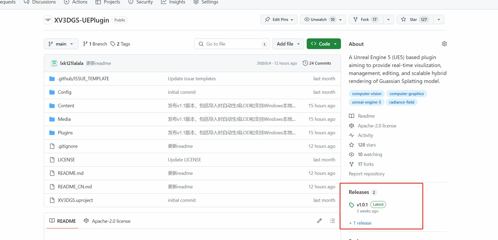

  2. 下载和你使用的ue版本对应的插件压缩包，推荐使用最新版本

  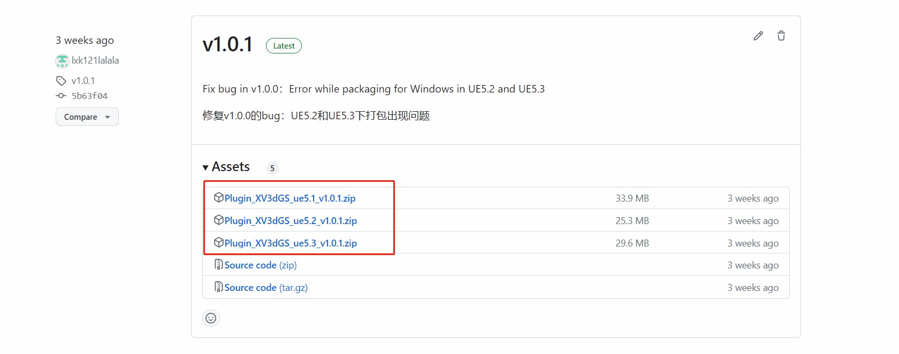

  3. 解压，把XV3dGS文件夹放在Plugins目录下

  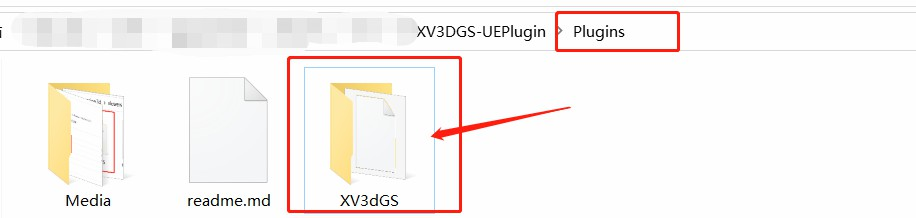


 ## 测试数据下载路径：

我们提供了两套测试数据：
 [百度网盘下载地址](https://pan.baidu.com/s/1-cwEXounPJBNtkJe5PJuSw?pwd=XV3D) [谷歌云盘下载地址](https://drive.google.com/drive/folders/1EgVZyYgFbYJqshA6xUheEG7JrEIgsmzR?usp=sharing)

其中:
- demo_fox_1080p.mp4和demo_office_1080p.mp4是两个示例mp4，用于测试XV3DTools本地训练
- demo_fox_gs.ply和demo_office_gs.ply是XV3DTools训练出来的3DGS模型，可以用本插件导入UE并实时渲染

 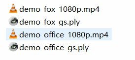


## 打开示例项目
本仓库已经提供了一个示例项目，其中包含一个示例关卡和场景以及我们的插件
可以通过如下指令下载

```
git clone https://github.com/xverse-engine/XV3DGS-UEPlugin.git
```

1. 打开 `XV3DGS.uproject` 启动UE
2. 打开 `demo` 关卡

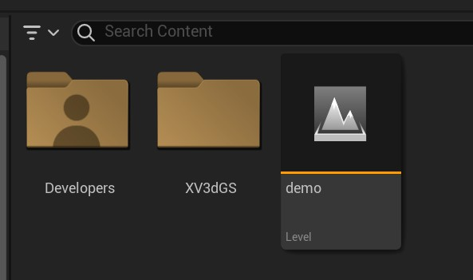

## 导入你自己的 Guassian Splatting 场景

### **v1.1.3新增功能，支持直接拖动多个ply到Content Browser实现批量导入**


点击导航栏上的加载资产按钮，或者window/XV3dgs

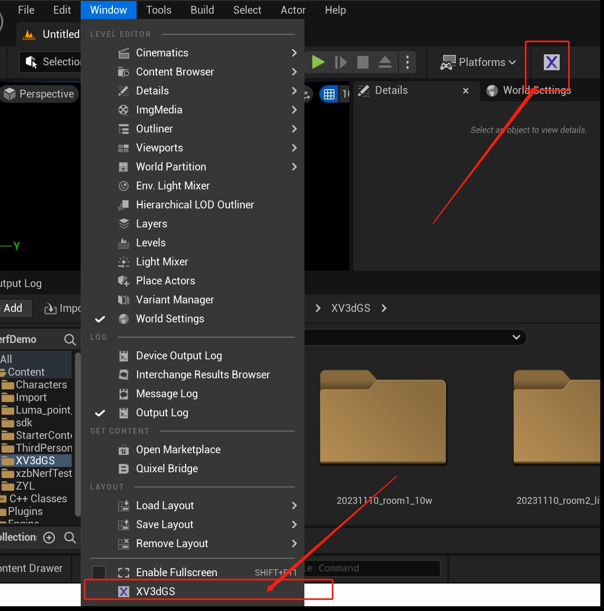

会弹出一个工具整合页面，默认是import ply页面,点击 import ply file 按钮

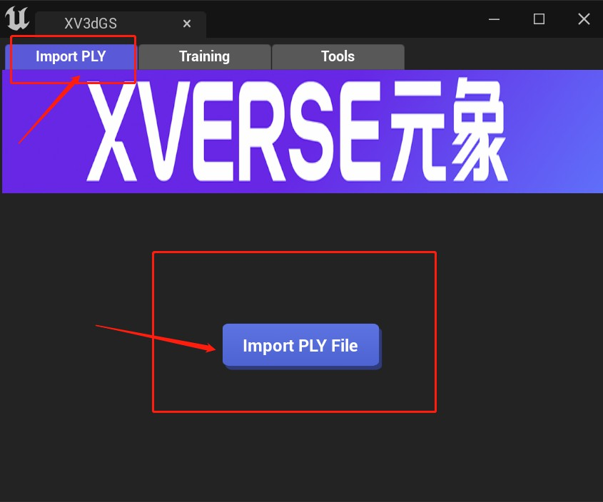

会弹出一个资源选择窗口

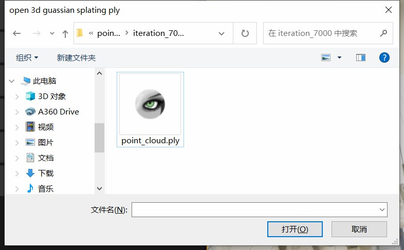

选择你自己的 Guassian Splatting 场景 (.ply 格式)，该场景会自动生成LOD并导入到内容浏览器中

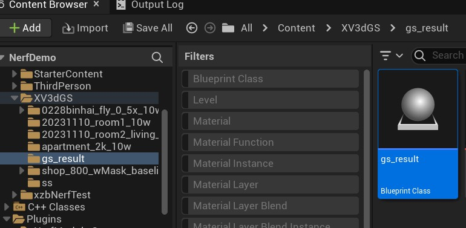

想要在关卡中可视化场景，只需要将对应的资产拖进关卡视口（Level Viewport）即可

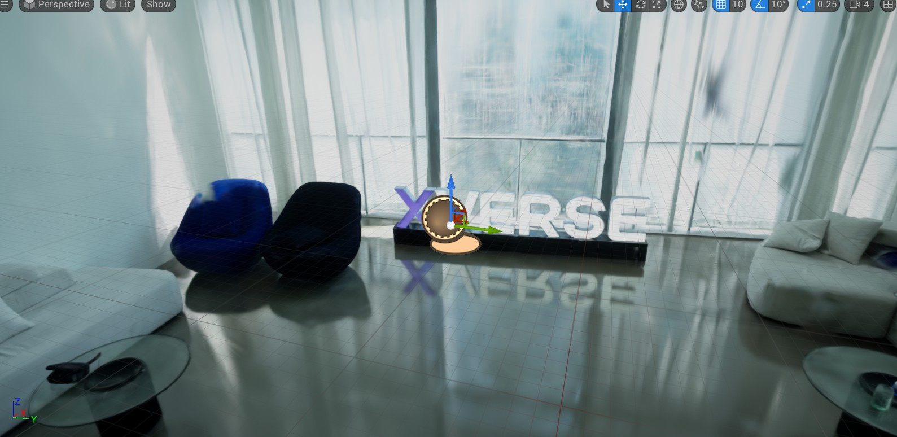

## windows平台下本地训练Gaussian Splatting ply

我们使用XV3DTools（**V1.1.1**）版本实现将MP4视频训练出Gaussian Splatting ply

 **_请注意:_** 使用前需要预先安装CUDA 11或更高版本[CUDA下载地址](https://developer.nvidia.com/cuda-downloads)

### XV3DTools使用步骤：

0. 从云盘下载XV3DTools工具（**V1.1.1**）至本地： 
- [百度网盘下载地址](https://pan.baidu.com/s/18ur5HcHFVIDiL0xfoMQYQQ?pwd=XV3D) 
- [谷歌云盘下载地址](https://drive.google.com/file/d/1o-P5hvNC6W3CH8MklGIZltt_-5yZtyHS/view?usp=sharing)

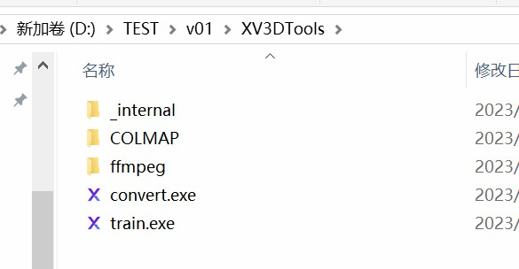

1. 点击图标，打开界面，切换到trainning页面


2. 点击参数右侧按钮，设置参数“XV3DTools Folder”为本地XV3DTools工具所在的路径，注意路径不能是中文，不能有特殊字符如#$%。

3. 点击参数右侧按钮，选择要处理的MP4文件，并将其设置为参数“Input MP4 Path”（要求视频帧率大于20），注意路径不能是中文，不能有特殊字符如#$%。

4. 点击参数右侧按钮，选择输出的文件夹，并设置为参数“Output Folder”，注意路径不能是中文，不能有特殊字符如#$%。

5. 点击Start Training按钮即可开始训练

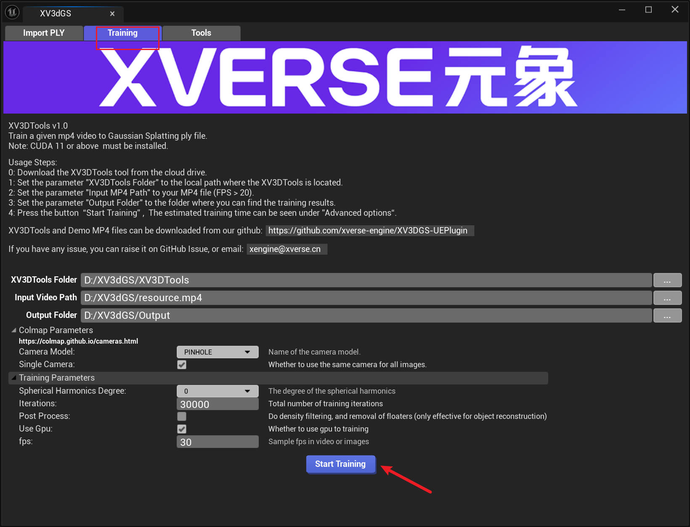

6. 在训练之前，可以打开Advanced Options，点击Refresh Estimated Time按钮预估训练时间。可以调整Training iteration per image 参数来控制每张图像的迭代次数。

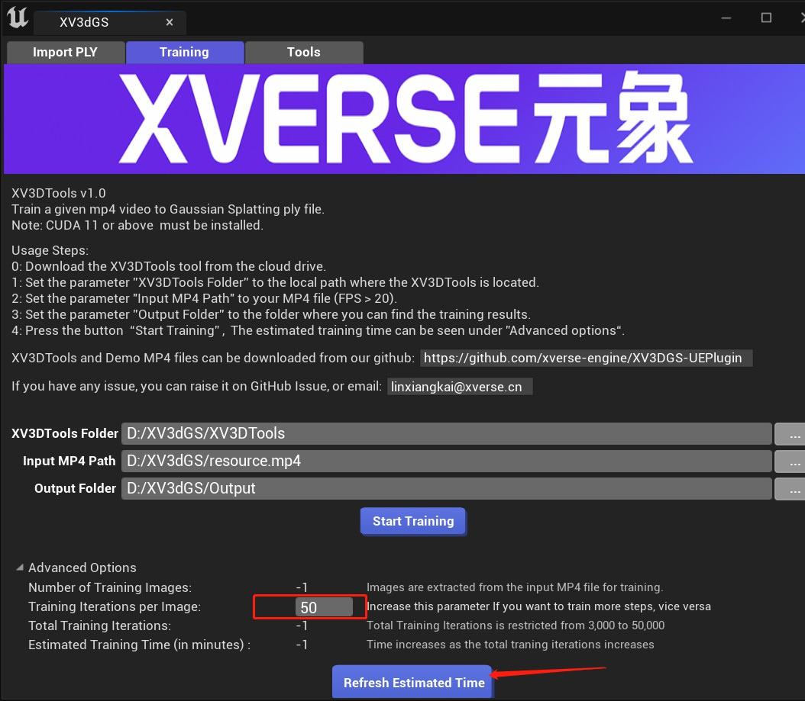

7. 训练完成后，从输出的文件夹下找到训练结果ply

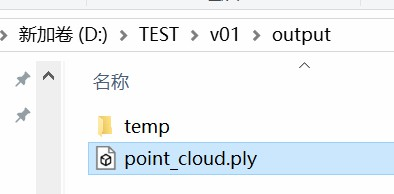

### 训练速度参考：
- 测试机配置：Windows 10，CUDA 11，GeForce RTX 2080（8GB显存），i9-9900处理器。
- demo_fox.mp4：视频总时长10秒，训练耗时10分钟
- demo_office.mp4：视频总时长430秒，训练耗时360分钟


## 如何把UE关卡打包成可执行程序

参考下面的文档，实现把自己的ue关卡打包成windows上可以运行的exe文件

[windows可执行程序打包教程](Media/Pack_CN.md)


我们提供一个打包好的关卡示例，可以从[github release](https://github.com/xverse-engine/XV3DGS-UEPlugin/releases)下载`pack_win_exe.zip`，解压后双击exe运行


# 特性介绍

### 旋转、平移、缩放（TRS）
在Outliner中选中拖入场景的 3D-GS actor，即可通过调整Transform来调整TRS

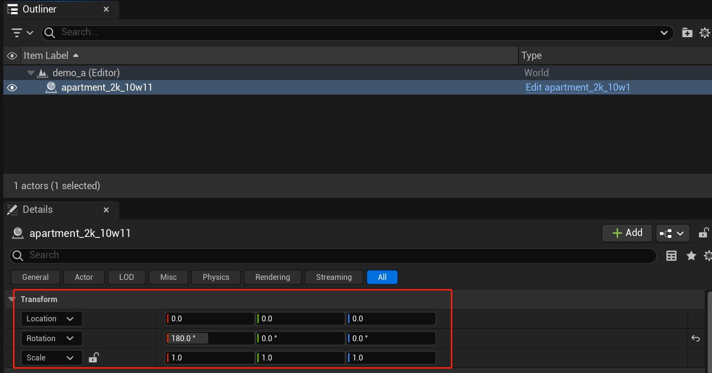

也可以在关卡视口中点击选中资产，通过控制GIZMO来旋转平移缩放模型


### 高斯点云裁剪

1. 点击选中你的Gaussian模型蓝图，点击选中Clip Volume Component，并勾选Clip Volume Component中的Visble框

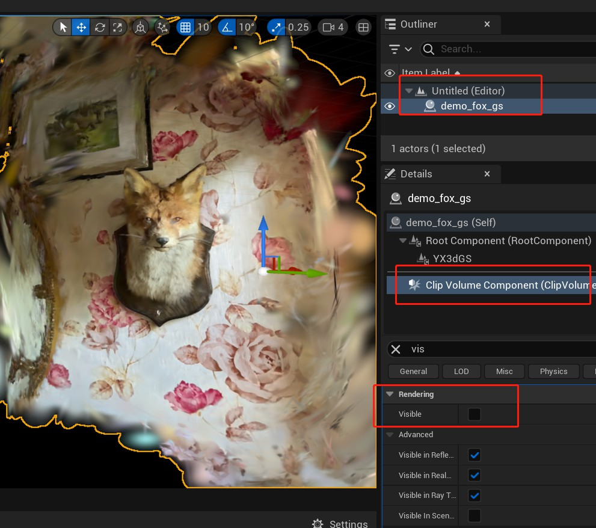

2. 保持选中Clip Volume Component，你可以在窗口中看到一个体积Volume，你可以通过修改Transform来修改volume的旋转平移缩放，也可以通过键盘快捷键wer可视化的调整GIZMO来实现旋转平移缩放

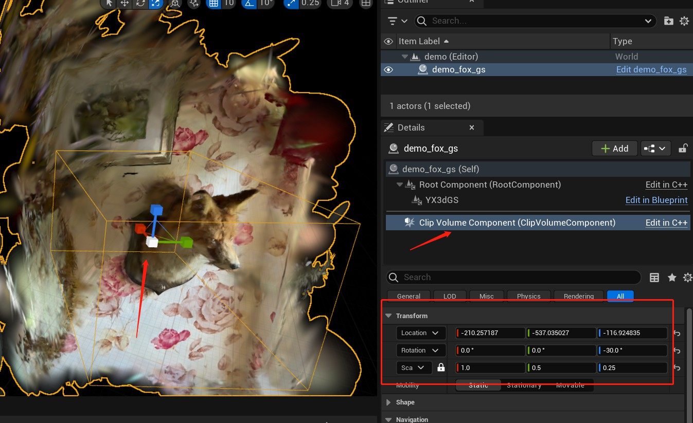

3. 保持选中Clip Volume Component，你可以在Crop Type中选择不同的剪裁方案，默认状态是不裁剪，你可以改成裁剪体积内或者体积外的部分。如图是剪裁掉体积外的部分

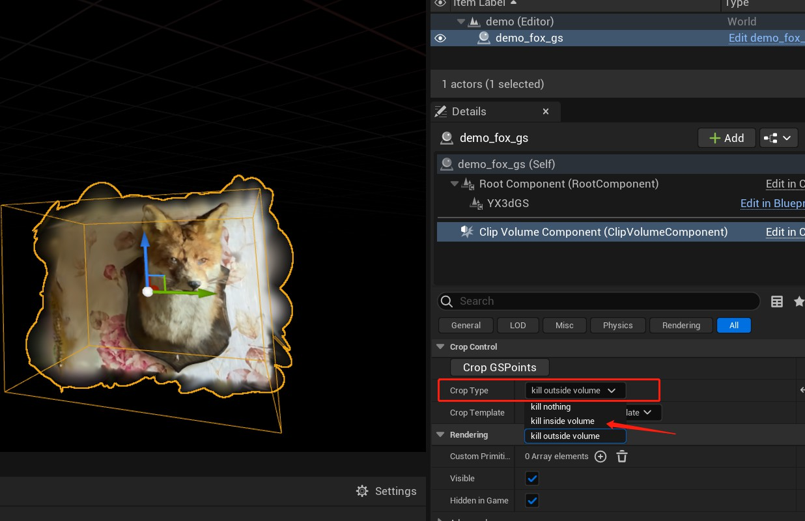

4. 点击Crop GSPoints按钮，可以把上面的部分剪裁出一个干净的niagara

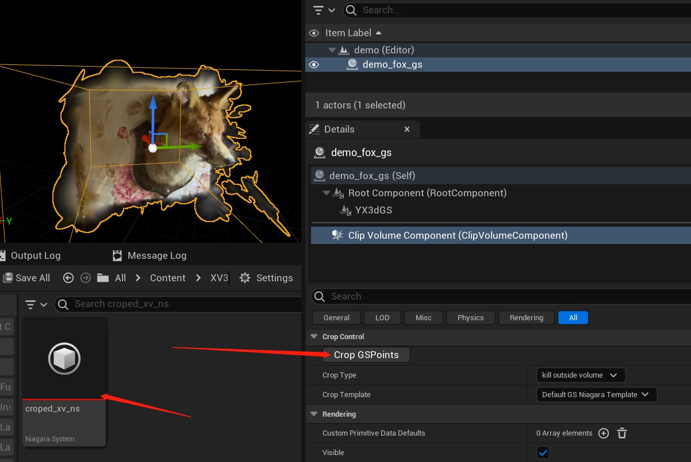

5. 这个干净的niagara可以用于后续做特效，具体请参考我们的特效教程

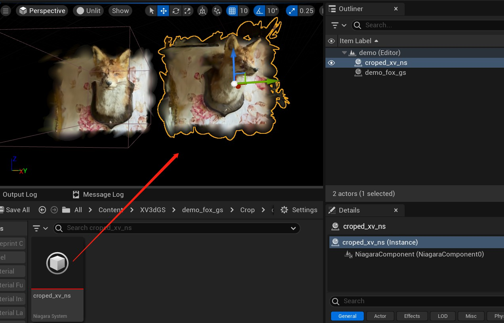

### 支持动态光照

默认是不接受动态光照
通过开启 with Relighting按钮启用接受动态光照

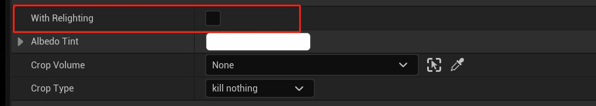

支持UE全部光源类型 
如下图是添加点光源

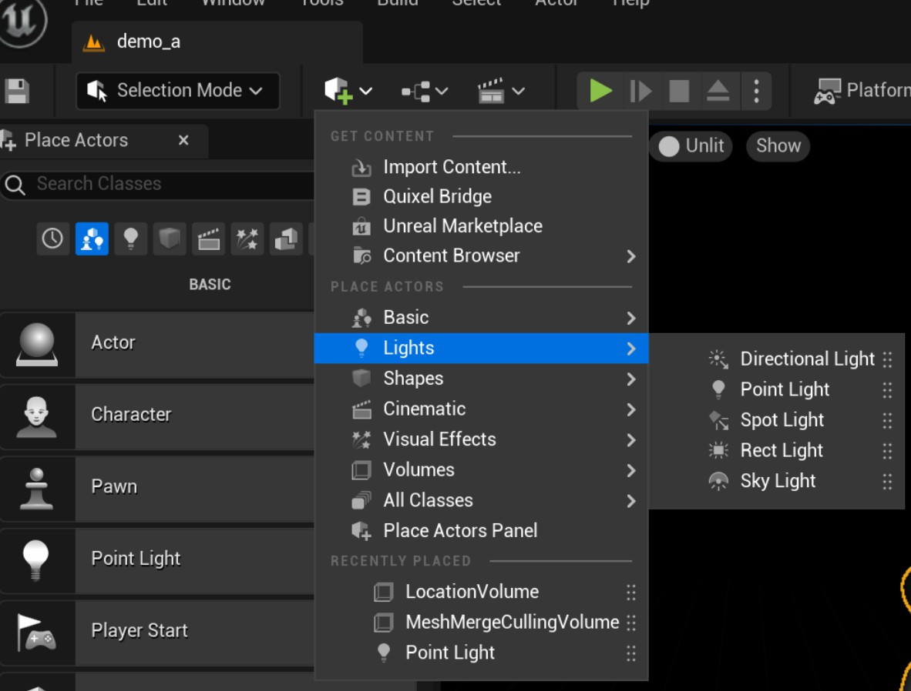

光源可以任意移动

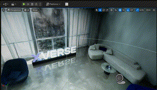

### 支持整体后处理改变颜色
通过修改AlbedoTint参数实现整体修改颜色

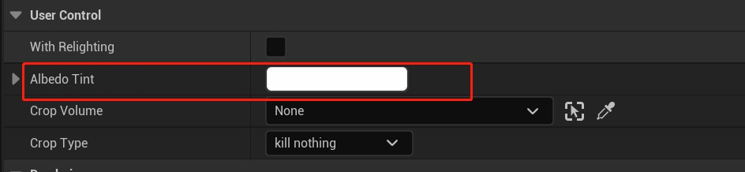

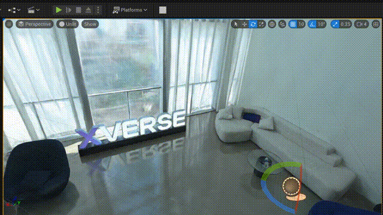

### LOD 
对于导入的点云会自动计算LOD，默认是在不超过niagara的200万点上限的基础上显式最大的一级LOD。可以使用参数“VisWhichLOD”强制指定使用那一级LOD
  
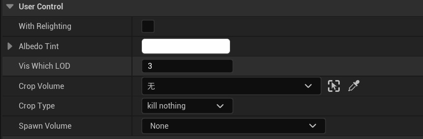

 
[v1.1.3](https://github.com/xverse-engine/XV3DGS-UEPlugin/tree/v1.1.3)
- 支持拖动多个文件Content Browser并导入
- 修复 buffer资产位置不正确时候的闪退问题
- 修复 XV3DTools 错误路径提示

[v1.1.2](https://github.com/xverse-engine/XV3DGS-UEPlugin/tree/v1.1.2)
- 支持更多类别ply头文件
- 修复移动物体闪烁的bug
- 更新UI

[v1.1.1](https://github.com/xverse-engine/XV3DGS-UEPlugin/tree/v1.1.1)
- 更新剪裁功能，实现剪裁出一个干净的niagara来做特效
- XV3DTools v1.1.1：支持用户调节训练迭代次数

[v1.1.0](https://github.com/xverse-engine/XV3DGS-UEPlugin/tree/v1.1.0)
- 导入时自动生成LOD，克服单个Niagara 200万点云数量限制
- Windows本地训练环境：使用XV3DTools，实现在windows平台下，给定mp4视频一键训练出Gaussian Splatting ply
- 修复transform的bug

[v1.0.1](https://github.com/xverse-engine/XV3DGS-UEPlugin/tree/v1.0.0)
- 修复v1.0.0的bug：UE5.2和UE5.3下打包出现问题

[v1.0.0](https://github.com/xverse-engine/XV3DGS-UEPlugin/tree/v1.0.0)
- 基于 Niagara 的高质量且实时的 3D Gaussian Splatting 模型渲染
- 轻松将原始 Gaussian Splatting 场景（.ply 文件）导入并在UE场景中渲染
- 与其他 UE 资产混合渲染
- 旋转, 平移, 缩放
- 裁剪
- 动态光照
- 整体调色
- 制作VFX效果

## Contributors

<a href="https://github.com/xverse-engine/XV3DGS-UEPlugin/graphs/contributors">
  
</a>